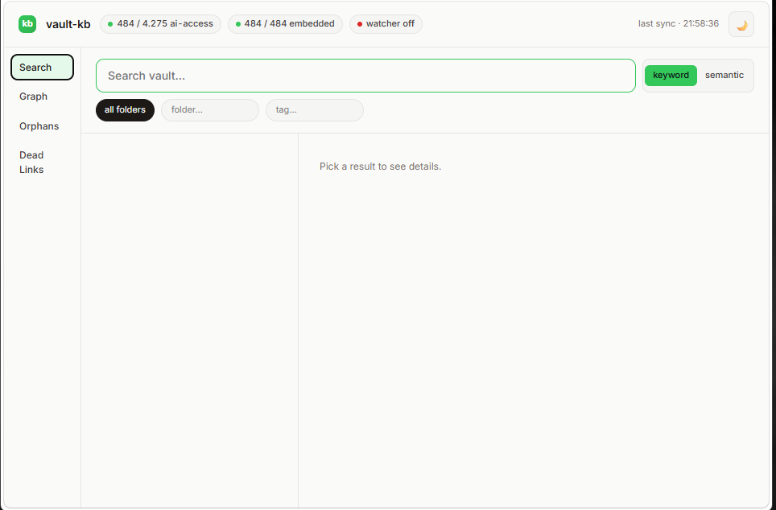
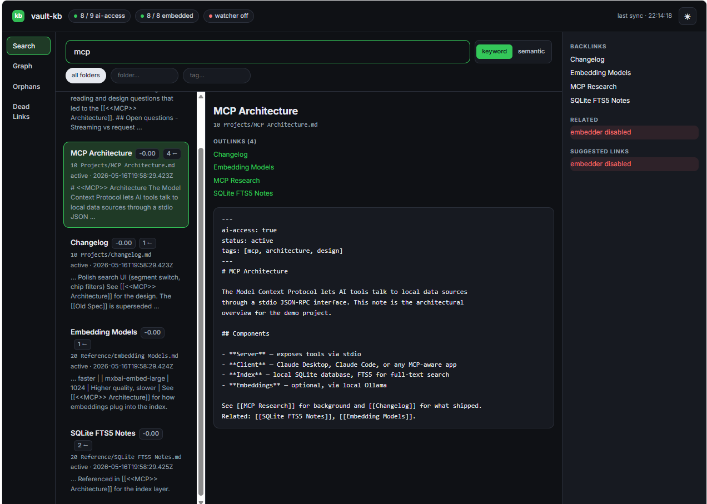
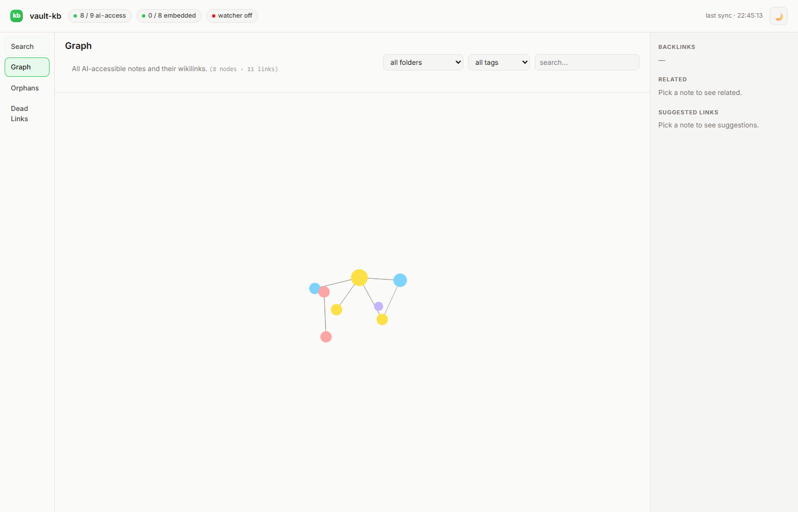
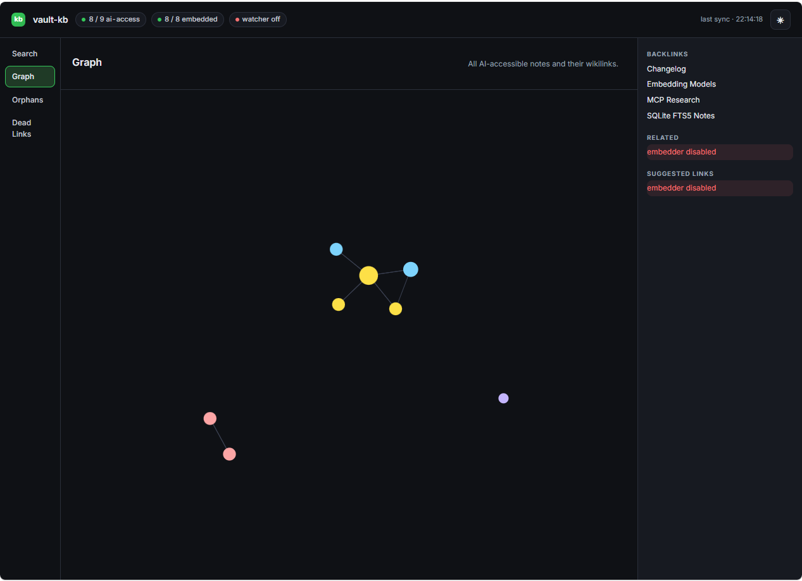

# vault-kb

Local MCP server that makes opt-in Obsidian notes searchable by AI tools (Claude Desktop, Claude Code, etc.).

Only notes with `ai-access: true` in frontmatter are indexed — everything else stays private. Nothing leaves your machine.

[](https://github.com/MinhQuangVu0101/vault-kb/actions/workflows/ci.yml)
[](LICENSE)

## Screenshots

Captured against the bundled demo vault (`test/fixture/demo-vault/`) — 8 notes across 4 folders so the link graph, folder-rainbow colors, and theme switch are all visible.

| Light | Dark |
|---|---|
|  |  |
|  |  |

## What it does

- **Search** your vault from any MCP-capable AI client.
- **Keyword search** (SQLite FTS5, BM25 ranking), **fuzzy search** (trigram fallback), and **semantic search** (local Ollama embeddings).
- **Link-graph awareness:** backlinks, outlinks, related notes, orphan detection, dead-link detection.
- **Bulk frontmatter edits** with dry-run + automatic revert bundles.
- **File watcher:** edits in Obsidian re-index incrementally within ~300 ms.
- **Optional local web UI** at `http://127.0.0.1:7345`.

## Privacy model

- Only notes with `ai-access: true` in frontmatter are indexed.
- Folders in `hardExcludedFolders` are never touched (defaults: `.obsidian`, `.obsidian-mobile`, `.git`, `.trash`).
- The MCP server is read-mostly: write tools (`kb_bulk_update`) require explicit `apply: true` and always produce a revert bundle.
- The SQLite index is local — no network calls except optional Ollama on `127.0.0.1`.
- The web UI loads Inter Variable from Google Fonts (cached after first load). Replace the `@import` in `public/style.css` to use a system font or self-host if you'd rather not.

## Install

Requires **Node.js ≥ 20**.

### Option A — Run from source (recommended right now)

```bash
git clone https://github.com/MinhQuangVu0101/vault-kb.git
cd vault-kb
npm install
```

Point the server at your vault — either via env var (portable):

```bash
# macOS / Linux
export VAULT_KB_VAULT_PATH="$HOME/Documents/obsidian-vault"

# Windows (PowerShell)
setx VAULT_KB_VAULT_PATH "C:\Users\YOU\Documents\obsidian-vault"
```

…or via a `vault-ai.config.json` next to `package.json`:

```json
{
  "vaultRoot": "/absolute/path/to/your/vault",
  "hardExcludedFolders": [".obsidian", ".obsidian-mobile", ".git", ".trash"]
}
```

The env var takes precedence when both are set. `hardExcludedFolders` is optional.

### Option B — `npx` (after publish)

Once published to npm:

```bash
VAULT_KB_VAULT_PATH="$HOME/Documents/obsidian-vault" npx vault-kb
```

## Wire it into your AI client

### Claude Code (per-project)

Create `.mcp.json` in your vault root:

```json
{
  "mcpServers": {
    "vault-kb": {
      "command": "node",
      "args": ["/absolute/path/to/vault-kb/src/index.js"],
      "env": {
        "VAULT_KB_VAULT_PATH": "/absolute/path/to/your/vault"
      }
    }
  }
}
```

### Claude Desktop

Add to `claude_desktop_config.json` (Settings → Developer → Edit Config):

```json
{
  "mcpServers": {
    "vault-kb": {
      "command": "node",
      "args": ["/absolute/path/to/vault-kb/src/index.js"],
      "env": {
        "VAULT_KB_VAULT_PATH": "/absolute/path/to/your/vault"
      }
    }
  }
}
```

Restart the client after editing.

## Opt notes in

Add to a note's YAML frontmatter:

```markdown
---
ai-access: true
---
```

The watcher picks up the change within ~300 ms. Without `ai-access: true` the note stays invisible to the server.

## MCP tools

| Tool | Purpose |
|---|---|
| `kb_search` | Full-text search (FTS5 / BM25), fuzzy fallback |
| `kb_semantic` | Embedding-based search (needs Ollama) |
| `kb_read` | Read one note; returns backlinks + outlinks |
| `kb_list` | List by folder, tag, or status |
| `kb_ingest` | Rebuild the index |
| `kb_stats` | Index health, watcher state, embedding coverage |
| `kb_bulk_update` | Batch frontmatter edits (dry-run by default, revert bundle written) |
| `kb_suggest_links` | Top-N similar but un-linked notes, with LLM-generated one-line reason |
| `kb_related` | Top-N similar notes (no link-graph filter) |
| `kb_orphans` | Notes with no incoming and no outgoing resolved links |
| `kb_dead_links` | Unresolved `[[references]]`, grouped by source note |

## Optional: semantic search via Ollama

`kb_semantic`, `kb_suggest_links`, and `kb_related` need a local Ollama with an embedding model:

```bash
# macOS
brew install ollama
brew services start ollama

# All platforms
ollama pull nomic-embed-text          # required for embeddings
ollama pull llama3.2:3b               # optional, for kb_suggest_links reasoning
```

On boot, the server probes Ollama (`/api/tags`, 2s timeout) and logs one of:

- `Ollama ready (<model>)` — both reachable and model installed.
- `WARN: model '<name>' not installed — run: ollama pull <name>` — Ollama up, model missing.
- `WARN: Ollama unreachable at <url> — run: ollama serve` — Ollama down.

The probe is non-blocking; FTS5 keyword search works regardless.

The chat model for `kb_suggest_links` is configurable via `llmModel` in `vault-ai.config.json`. Without it, suggestions still come back — just without the `why:` line.

## CLI

```bash
npm run ingest          # Build/rebuild the index
npm run inspect-config  # Print resolved config
npm run smoke           # Spawn the server and call a few tools
npm test                # Unit tests (no vault needed — tests build tmp vaults)
npm start               # Start the MCP server (stdio)
npm start -- --no-embed         # Skip embeddings
npm start -- --no-llm-summary   # Score-only link suggestions
npm start -- --no-watcher       # Skip file watcher
npm start -- --web              # Also serve the local web UI
```

Source-only helpers (clone the repo to use): `scripts/bulk.js` for bulk frontmatter edits with `--help`, and `scripts/regression-harness.js` for reading every indexed note and reporting failures.

## Optional: remote dashboard via Cloudflare Tunnel

To reach the web UI from a laptop or phone outside your LAN, route it through a Cloudflare Tunnel gated by Cloudflare Access. vault-kb keeps binding to `127.0.0.1`; Cloudflare handles auth (email OTP, restricted to your address).

**Prereqs:** a Cloudflare account and one domain on Cloudflare. The dashboard will live at `vault.<your-domain>`.

```bash
brew install cloudflared
cloudflared tunnel login
cloudflared tunnel create vault-kb
```

The `create` command prints a tunnel UUID. Create `~/.cloudflared/config.yml`:

```yaml
tunnel: <UUID>
credentials-file: /Users/<you>/.cloudflared/<UUID>.json
ingress:
  - hostname: vault.<your-domain>
    service: http://localhost:7345
  - service: http_status:404
```

Route DNS and start:

```bash
cloudflared tunnel route dns vault-kb vault.<your-domain>
cloudflared tunnel run vault-kb
```

The dashboard is now reachable at `https://vault.<your-domain>` — **but it is public until you add an Access policy.** In the Cloudflare dashboard → Zero Trust → Access → Applications → Add an application:

- Type: **Self-hosted**
- Subdomain: `vault`, Domain: `<your-domain>`, Path: empty
- Identity provider: **One-time PIN**
- Policy → Action: **Allow** → Include: **Emails** → `<your-email>`

Install as a service so the tunnel survives reboots:

```bash
sudo cloudflared service install
```

Optionally let the boot log show the public URL:

```bash
export VAULT_KB_PUBLIC_URL=https://vault.<your-domain>
```

See the [Cloudflare Tunnel docs](https://developers.cloudflare.com/cloudflare-one/connections/connect-networks/) and [Access docs](https://developers.cloudflare.com/cloudflare-one/applications/) for troubleshooting.

## Observability

Every tool call is logged as a JSON line to `~/.cache/vault-kb/vault-kb.log` (rotates at 10 MB). Failures also surface in `kb_stats.recentErrors` (last 20).

## Tech

- Node.js ≥ 20
- [`@modelcontextprotocol/sdk`](https://github.com/modelcontextprotocol/sdk) — MCP server
- [`better-sqlite3`](https://github.com/WiseLibs/better-sqlite3) — FTS5 search
- [`chokidar`](https://github.com/paulmillr/chokidar) — file watcher
- [`gray-matter`](https://github.com/jonschlinkert/gray-matter) — frontmatter parsing
- [`zod`](https://github.com/colinhacks/zod) — config + tool-arg validation

## License

[MIT](LICENSE)
